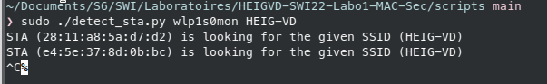

# SWI - Rapport - Laboratoire 1

> Auteurs: Jean-Luc Blanc & Noémie Plancherel
>
> Date: 27.03.22

## Deauthentication attack

**Question** : quel code est utilisé par aircrack pour déauthentifier un client 802.11. Quelle est son interpretation ?

Le code utilisé par aircrack pour déauthentifier est le "-0". Ce code représente le "deauthentication attack mode". Ci-dessous, la commande aircrack pour pouvoir déauthentifier un client:

```sh
 aireplay-ng -0 1 -a 00:14:6C:7E:40:80 -c 00:0F:B5:34:30:30 ath0
```

- `-0` signifie déauthentification
- `1` est le nombre de "deauths" à envoyer, `0` en envoie continuellement
- `-a 00:14:6C:7E:40:80` est l'adresse MAC de l'AP
- `-c 00:0F:B5:34:30:30` est l'adresse du client à déauthentifier, si aucun paramètre n'est précisé, tous les clients de l'AP sont déconnectés
- `ath0` est le nom de l'interface

**Question** : A l'aide d'un filtre d'affichage, essayer de trouver d'autres trames de déauthentification dans votre capture. Avez-vous en trouvé d'autres ? Si oui, quel code contient-elle et quelle est son interpretation ?

Nous pouvons ci-dessous voir deux captures Wireshark avec des trames de déauthentification. Une trame avec le code 03, `Station is leaving (or has left) IBSS or ESS` et une autre avec le code 07, `Class 3 frame received from nonassociated station`.

Le code 3 indique que l'AP s'est déconnecté et a déhauthentifié le client.


Le code 7 indique qu'une station a tenté de transférer des données vers l'AP avant leur association.


b) Développer un script en Python/Scapy capable de générer et envoyer des trames de déauthentification. Le script donne le choix entre des Reason codes différents (liste ci-après) et doit pouvoir déduire si le message doit être envoyé à la STA ou à l'AP :

- 1 - Unspecified
- 4 - Disassociated due to inactivity
- 5 - Disassociated because AP is unable to handle all currently associated stations
- 8 - Deauthenticated because sending STA is leaving BSS

**Question** : quels codes/raisons justifient l'envoi de la trame à la STA cible et pourquoi ?

Les raisons **4** et **5** car la raison 4 indique le délai d'expiration de la session client et la raison 5 indique que l'AP n'est pas disponible à l'instant. La station cliente n'est pas censée connaître ces deux informations lorsqu'elle souhaite se connecter ou lorsqu'elle est déjà connectée, c'est pourquoi c'est directement l'AP qui envoie les trames de déhautentification.

**Question** : quels codes/raisons justifient l'envoi de la trame à l'AP et pourquoi ?

Les raison **1** et **8** car la raison 1 n'a pas vraiment de justification et la raison 8 indique que c'est la station client elle-même qui se déconnecte.

**Question** : Comment essayer de déauthentifier toutes les STA ?

En précisant l'adresse de broadcast comme target `ff:ff:ff:ff:ff:ff`

**Question** : Quelle est la différence entre le code 3 et le code 8 de la liste ?

Le code 8 est pour BSS (Basic Service Set) et le code 3 est pour IBSS (Independant Basic Service Set) et ESS (Extended Service Set). Ces 3 paramètres sont les 3 configurations possibles d'un réseau sans-fil et ils fonctionnent les 3 de manière différente.

**Question** : Expliquer l'effet de cette attaque sur la cible

La cible se retrouve déconnectée du réseau sans fil dû à la récéption de trames de déhauthentification.

**Fonctionnement**

Nous avons choisi d'ajouter la cible, l'AP ainsi que l'interface en arguments du script python. Il y a également 3 autres paramètres optionnels:


Afin de récupérer les informations que l'on a besoin, nous pouvons exécuter la commande `sudo airodump-ng wlp1s0mon` afin de visualiser tout le trafic de l'interface et de sélectionner la cible.


Nous allons séléctionner la cible `6C:6A:77:53:CE:79` qui est associé avec l'AP `HUAWEI P30`. 


Nous allons déconnecter la station de l'AP en envoyant des trames de déhauthentification avec le reason code 1. Ci-dessous, nous pouvons constater que le script fonctionne correctement.


## Fake channel evil twin attack

__Question__ : Expliquer l'effet de cette attaque sur la cible

L'attaque va créer un faux point d'accès sur un nouveau channel en se basant sur un réseau qui existe déjà. 

**Fonctionnement**

Nous avons décidé d'ajouter l'interface comme argument du script:


Ainsi, pour lancer l'attaque, on effectue la commande suivante:

```sh
sudo ./fake_channel.py wlp1s0mon
```

Une fois le script lancé, une liste des SSID à proximité, avec une recherche active, s'affichera pendant quelques secondes. L'utilisateur pourra ensuite choisir le réseau à attaquer en entrant le BSSID voulu. Finalement, les paquets du beacon concurrent s'envoient en broadcast sur tout le réseau.


Ainsi, nous pouvons constater que le beacon avec le BSSID `3e:94:ed:be:e2:e0` et le SSID `SONIDOMI` envoie continuellement des trames en broadcast.


## SSID flood attack

**Fonctionnement**

Pour l'utilisation du script, nous avons ajouté l'interface comme argument et un paramètre facultatif pour ajouter le fichier avec les ssid:


Si l'utilisateur n'ajoute pas de fichier en paramètre, il doit spécifier le nombre de AP qu'il souhaite générer:


Pour chaque paquet envoyé, une adresse MAC de l'AP est générée aléatoirement avec la classe `RandMAC()` et un ssid est également généré aléatoirement. Nous avons décidé de générer un string minuscule de 10 caractères alphabétiques. 


La deuxième option du script permet à un utilisateur d'ajouter un fichier avec des ssid à l'intérieur et pour chaque nom, un AP sera généré. Le contenu du fichier de l'exemple ci-dessous est:

```sh
hello
how
smile
```

La commande avec le fichier en paramètre:


Avec la capture ci-dessous, nous pouvons voir les 3 différents AP avec des adresses MAC générées aléatoirement. Nous pouvons également voir les 3 ssid du fichier.


## Probe Request Evil Twin Attack

**Question** : comment ça se fait que ces trames puissent être lues par tout le monde ? Ne serait-il pas plus judicieux de les chiffrer ?

```
Ces trames doivent pouvoir être accessible par tout le monde puisque c'est le système utilisé pour détecter les Wi-Fi aux alentours.
```

**Question** : pourquoi les dispositifs iOS et Android récents ne peuvent-ils plus être tracés avec cette méthode ?

```
Parce que le MAC est désormais randomisé à chaque connection
```

## Détection de clients et réseaux

a) Développer un script en Python/Scapy capable de lister toutes les STA qui cherchent activement un SSID donné

**Fonctionnement**

Nous avons ajouté l'interface ainsi que le ssid à chercher en arguments du script:


Ainsi, nous avons lancé le script en cherchant le ssid `HEIG-VD`:



